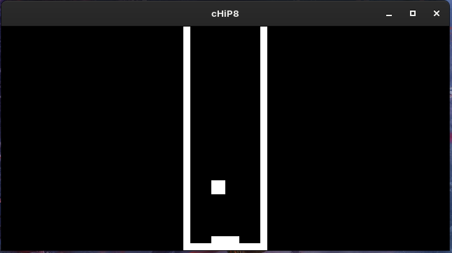
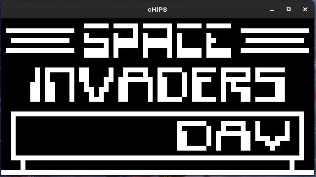

# 🕹️ CHIP-8 Emulator

A simple CHIP-8 emulator written from scratch in C++.  
Built out of curiosity to explore **low-level systems**, **emulation**, and **how real hardware is mimicked in software**. This is my first real C++ project, and most games run perfectly!

---

## 📸 Screenshot




---

## 🚀 Features

- 🧠 **Interprets all CHIP-8 instructions** (based on [CHIP-8 technical reference](http://devernay.free.fr/hacks/chip8/C8TECH10.HTM#dispcoords))
- ⌨️ Full keyboard input support (mapped to CHIP-8 hex keys)
- 🖼️ 64x32 monochrome display rendered with [your rendering library here — SFML/SDL/OpenGL/etc.]
- 🔉 Optional sound buzzer support
- 💾 ROM loading from file

---

## ✅ ROM Compatibility

- Most popular CHIP-8 ROMs (like **Pong**, **Tetris**, **Breakout**) work perfectly ✅
- A few advanced or timing-sensitive ROMs may have glitches ❌  
  (Improving timing accuracy and opcode edge cases is a future goal)

---

## 🛠️ Build Instructions

### Dependencies

- C++17 or later
- SFML for graphics and input

### Linux / macOS

```bash
git clone https://github.com/python-fuse/chip8-emulator.git

cd chip8-emulator

make

./chip8 path/to/rom.ch8
```

### Windows (MinGW or MSVC)

```
Clone repo

Open in your favorite IDE or compile with:

g++ -std=c++17 src/*.cpp -o chip8 -lsfml-graphics -lsfml-window -lsfml-system
Run:

chip8 path\to\rom.ch8
```

## 🎮 Controls

CHIP-8 Keypad Keyboard

```
1 2 3 C  1 2 3 4
4 5 6 D  Q W E R
7 8 9 E  A S D F
A 0 B F  Z X C V

(You can customize these mappings in the source code)
```

## 📚 Resources Used

- CHIP-8 Technical Reference

- Cowgod's Chip-8 documentation

- Community blog posts and emulator dev guides

## 🧠 What I Learned

- Low-level memory layout and stack manipulation

- Instruction decoding and opcode implementation

- Timing and clock cycles

- Input handling and rendering pipelines

- How real consoles and interpreters work behind the scenes

## 📦 ROMs

Due to copyright, ROMs are not included. You can find freely available test ROMs and games online (e.g., here).

## 🧪 TODO / Improvements

Add configurable timers and improve accuracy

Add debugger / step-through execution

Better error messages and crash handling

Save/load emulator state

Disassembler or visual instruction viewer

# 📄 License

MIT License — see LICENSE

# 🙌 Author

Umar Muktar
[GitHub](https://github.com/python-fuse)

Feedback, forks, and contributions welcome!
